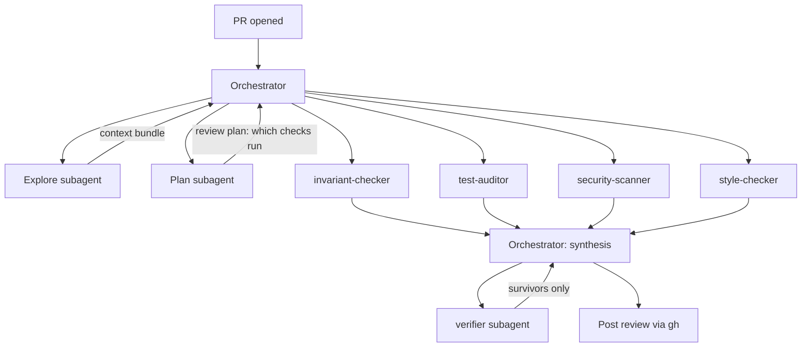

# Review Bot Architecture

How the work of reviewing a PR is split across subagents, and why each one exists.

[`REVIEW_POLICY.md`](REVIEW_POLICY.md) defines *what* to check. This file defines *who* checks it.
The two are deliberately separate: the policy changes as the app grows, the pipeline should not.

## The constraint that shapes everything

Claude Code subagents **start cold**. Each one gets a fresh context window, cannot see what another
subagent found, and returns a report only to the orchestrator. Nothing is shared implicitly.

This has two consequences the design has to answer for:

1. **Re-derivation is the default failure.** Point four checkers at a PR with no preparation and
   each one independently reads the diff, opens `database_helper.dart`, and works out what the app
   does. Four times the tokens for one repo's worth of understanding — and four subtly different
   understandings, which is worse than the cost.
2. **The orchestrator is the only bus.** Explore's findings reach the checkers only because the
   orchestrator copies them into each checker's prompt. There is no shared memory to lean on.

So: gather context **once**, package it, hand the same package to every checker.

## Pipeline

Stages 3 and 4 fan out in parallel; everything else is sequential.

---

## The subagents

### 1. Explore — gather context

**Exists because:** the four checkers would otherwise each re-read the repo from scratch. This is
the single biggest cost saving in the design, and the main source of consistency: every checker
reasons about the same facts.

**Reads:** the PR diff, every changed file in full, the tests covering those files, and the
neighbours the changed code actually touches (a diff in `providers.dart` pulls in
`database_helper.dart`, because the golden rule spans both).

**Returns a context bundle:** changed files with their diff hunks, the surrounding definitions,
which policy sections the changed paths map to, and which invariants the touched code is
load-bearing for. Facts only — no judgement. The moment Explore starts saying "this looks wrong"
it is doing the checkers' job with none of their focus.

**Why the built-in `Explore` type:** it is read-only. A context-gathering step must not be able to
edit the branch it is reading.

### 2. Plan — decide what to review

**Exists because:** not every PR needs every check. A README typo does not need the security
scanner, and running it anyway is how you train yourself to skim the bot's output. Plan reads the
bundle and returns which checkers to run, on which files, against which policy sections.

It is also where the **severity budget** lives: a 12-line bugfix that produces nine "Consider"
comments has failed, regardless of whether the nine are individually correct. Plan caps the
expected finding count so the fan-out cannot flood a small diff.

**Why a subagent and not a hardcoded rule:** file-extension routing (`*.md` → style only) breaks
immediately. A change to `docs/state-management.md` that rewrites the golden rule is a correctness
concern in a Markdown file. Deciding what a diff *means* needs a model.

**Cheapest place to skip work:** Plan is allowed to return "no checks" and end the run.

### 3. The checkers — focused, parallel, one rubric each

Four custom subagents, each owning one section of the policy. All four get the same context bundle
in their prompt.

| Subagent | Owns | Why it is its own agent |
|---|---|---|
| `invariant-checker` | Policy §1 Correctness | The only checker that can produce Blocking findings about money and stock. Given a shared window it would spend attention on style and under-weight sale atomicity. It gets its own so it cannot be distracted. |
| `test-auditor` | Policy §2 Tests | Asks one question — does this change need a test that is not here — and answers it against the suite. Wants deep test knowledge, not app knowledge. |
| `security-scanner` | Policy §3 Security | The narrowest rubric: SQL interpolation, new network calls, unguarded destructive paths, new permissions. Kept separate mostly to keep the threat model *small*. A general reviewer talks itself into web-app findings that do not apply to an offline on-device app. |
| `style-checker` | Policy §4 Style | Deliberately thin — `flutter analyze` already runs in CI. It only sees what the linter cannot: theme tokens, SQL escaping `DatabaseHelper`, PR title format. Exists to be skippable. |

**Why split at all**, given four agents cost more than one: separation buys focus and independence.
Each checker's noise stays in its own window instead of polluting the others' reasoning, and one
checker having a bad run does not corrupt the rest. The parallel fan-out also means wall-clock is
the slowest checker, not the sum.

**Why these four and not more:** the split follows the policy's sections, so there is exactly one
owner per rubric and no negotiation about who reports what. More agents would mean overlapping
rubrics, which means duplicate comments, which the policy forbids.

### 4. Synthesis — the orchestrator's own job

Not a subagent. The orchestrator holds every checker's report and:

- **Deduplicates.** Overlap is designed in: a `where: 'name = $name'` is both a Blocking security
  finding and a correctness bug. The policy says one comment per problem, so someone has to merge
  them. Only the orchestrator sees all four reports.
- **Normalizes severity.** Four agents rate independently; "Should fix" from the test auditor and
  from the security scanner must mean the same thing to the reader.
- **Enforces the budget** Plan set, dropping the weakest findings if the diff is small.
- **Relays.** Subagent reports are not shown to the user. Whatever the orchestrator does not say
  out loud, nobody reads.

### 5. Verifier — the anti-noise pass

**Exists because false positives are what get a bot muted**, and a muted bot catches nothing. This
is the whole bet of the design.

Takes the deduplicated findings and re-reads the actual code with fresh eyes, without the context
bundle. For each finding it asks: does the described failure really happen, on these lines, as
written? Findings that survive get posted; findings that do not get dropped silently.

**Why cold context is the point here:** the bundle is what made the checkers confident. Handing the
verifier the same framing would reproduce the same mistake. It must be able to say "the code does
not say what you think it says."

Runs once over all findings rather than per-checker — it needs to see the merged set to catch a
finding that only looks right in isolation.

---

## Tradeoffs, stated plainly

- **This is more machinery than a small PR deserves.** Six agents on a two-line fix is theatre.
  Plan's authority to skip checkers, and to end the run outright, is what keeps that honest — it is
  a load-bearing part of the design, not an optimization.
- **Cold starts cost tokens.** The context bundle amortizes the reading, but each subagent still
  pays to boot. Accepted, in exchange for focus and parallelism.
- **The bundle is a single point of failure.** If Explore misses a file, four checkers are
  confidently blind in the same way. Mitigated by the verifier working without the bundle — it is
  the one stage that can notice the gap.
- **Nondeterminism.** Independent agents disagree on severity across runs. Synthesis normalizes,
  but the review will not be byte-identical between runs on the same PR.

---

# Context management

Context is the budget this pipeline actually spends. Not money, not wall-clock — **room in the
orchestrator's window**, which is finite and which nothing gives back. A review that reads the whole
repo into the main session works once, on a small PR, and then never again.

So the rule the whole design serves: **the orchestrator must never hold a file.** It holds a bundle,
four reports, and a verdict. Everything else happens somewhere it can be thrown away.

## Measured, not assumed

One full run against `fixture/cart-checkout-do-not-merge` (3 files, +42/-0):

| Stage | Tokens spent | Tool calls | Returned to main session |
|---|---:|---:|---|
| `pr-context-explorer` | 54,801 | 21 | ~200-line bundle |
| `invariant-checker` | 33,343 | 4 | 2 findings |
| `test-auditor` | 41,018 | 2 | 1 finding |
| `security-scanner` | 35,715 | 2 | 1 line |
| `style-checker` | 35,504 | 2 | 1 line |
| **Total** | **200,381** | **31** | **~320 lines** |

Roughly **200k tokens of work; ~320 lines reached the orchestrator.** The other ~99% was spent in
windows that were discarded on completion. That ratio is the design, stated as a number.

The checkers' 2–4 tool calls each are the second thing worth reading in that table. They are not
exploring. They read their rubric, read the bundle, and answered. The one that used four
(`invariant-checker`) spent two confirming line numbers before reporting them.

## The five strategies, and what each one buys

**1. Fan-out as disposal.** A subagent's context dies with it. Explore burned 54,801 tokens across
21 tool calls to understand a 42-line diff; the orchestrator paid ~200 lines for the result. This is
the largest lever by an order of magnitude, and it is not really "delegation" — it is choosing where
to *spend* context so that it can be *dropped*.

**2. The bundle as a compression checkpoint.** Explore's job is a lossy encode: 21 tool calls of
repo reading down to one structured artifact. What makes it work is that the loss is *directed* —
the format names a drop order (`cut quoted code first, then neighbours, never the test findings or
the load-bearing list`), so when the cap bites, the agent sheds the recoverable material and keeps
the expensive-to-recompute material. An undirected "be concise" drops whatever is at the bottom.

**3. Scoped tools as a budget ceiling.** The checkers have `Read` and `Grep`, and instructions to
open only files the bundle names, only to confirm a line they are about to report. This is a context
control, not a security one: an agent that may explore *will*, and four exploring checkers rebuild
the repo understanding four times — the exact cost the bundle was written to buy out once. The
measured 2–4 tool calls per checker are that instruction holding.

**4. Facts and judgement, split.** Explore reports what the code *is*; checkers decide what it
*means*. The context argument for the split: a bundle carrying verdicts invites its readers to
argue with them, and arguing requires re-reading the evidence. Facts are cheap to accept.

**5. Not spending it at all.** Plan may skip checkers or end the run. On a docs-only PR the correct
token spend is close to zero, and the pipeline has to be able to reach zero. The cheapest context is
the context never allocated.

## Where it is paid twice, honestly

**The bundle is relayed to all four checkers, so it is paid for four times.** Subagents cannot read
each other's output; the orchestrator copies the bundle into each prompt. At ~200 lines that is a
few thousand tokens × 4 — visible in the checkers' 33–41k floors, most of which is bundle plus
rubric, not work.

This is a real cost of the fan-out and it is worth stating rather than hiding: a single reviewer
holding one window would not pay it. It buys focus, isolation, and parallelism, and it is the price
of those. It also puts a hard ceiling on bundle size that has nothing to do with the orchestrator's
window — **every line Explore adds costs five times over**, so the 400-line cap is not tidiness, it
is arithmetic.

## Compaction is a fallback, not a strategy

Long sessions get summarized by the harness. That is a safety net for when the design leaks, not
part of the design. Compaction is lossy in an *undirected* way — it does not know that the
load-bearing list matters more than a quoted hunk. Every strategy above exists so that compaction
never has to make that choice for us.

If the orchestrator is being compacted mid-review, something has already gone wrong: a checker
returned a wall of text, or Explore ignored its cap, or someone read a file into the main session
"just to check". Treat it as a bug, not weather.

## Rules of thumb

- The orchestrator reads reports. It does not read code. If it needs code, that is a missing bundle
  field, not a reason to open the file.
- Cap every subagent's output, and say what to cut first. A cap without a drop order is a lottery.
- Never re-run a search another agent already ran and reported. Trust the bundle's `Tests` section.
- The bundle's `Gaps` section is a context instrument. A gap costs a follow-up; a *silent* gap costs
  a wrong review.
- Measure before optimizing. The numbers above took one run to collect and immediately showed that
  Explore, not the checkers, is where the tokens go.

---

## What runs where

The subagent definitions live in `.claude/agents/*.md`. The orchestrator is a Claude Code session
triggered on `pull_request`, posting through `gh pr comment`.

Note: Claude Code registers `.claude/agents/` at session start. Agents added mid-session are not
callable by name until the session restarts — which is why the CI orchestrator boots fresh per PR
and never hits this.
